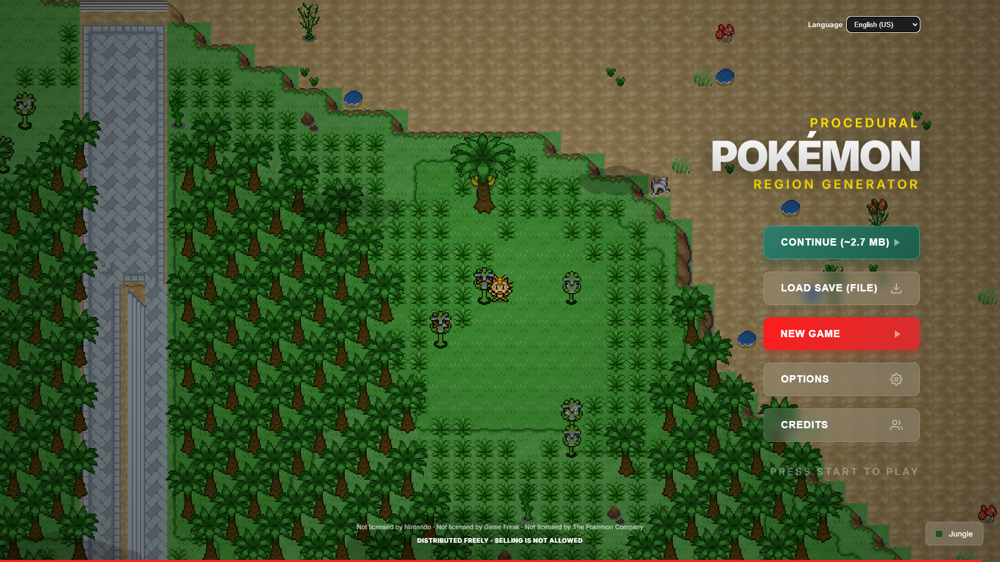
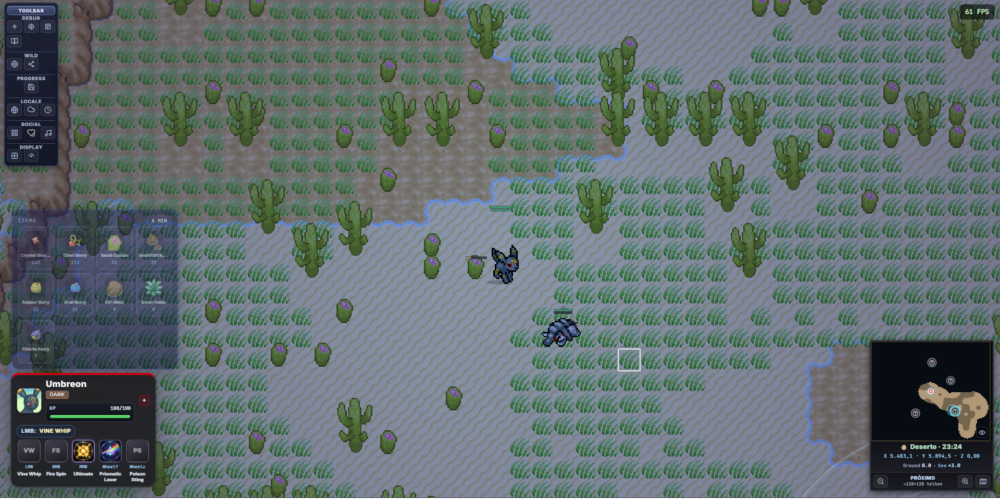
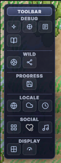
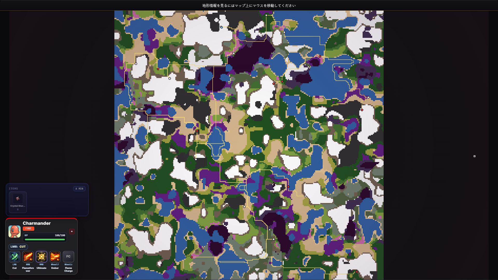
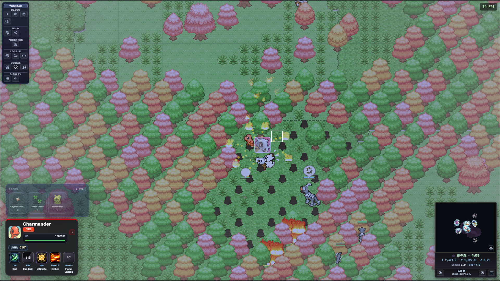
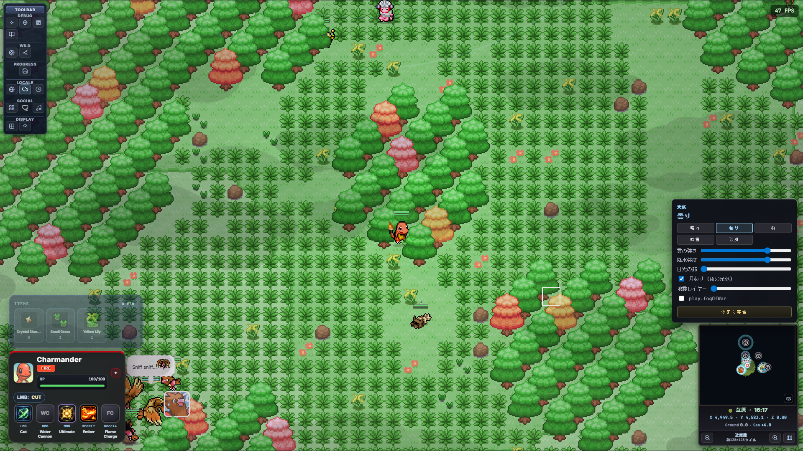
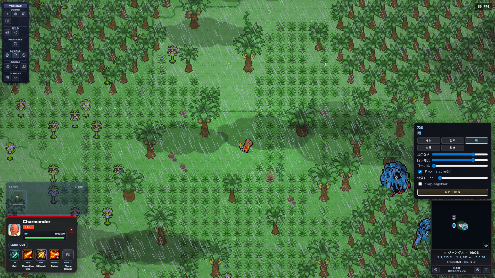
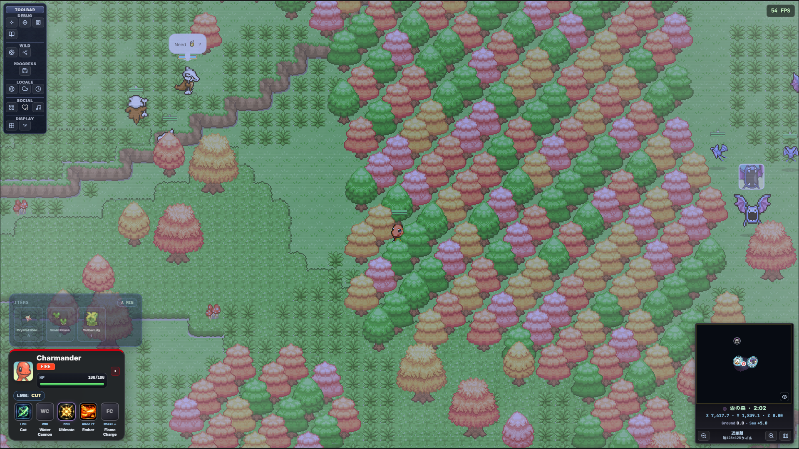
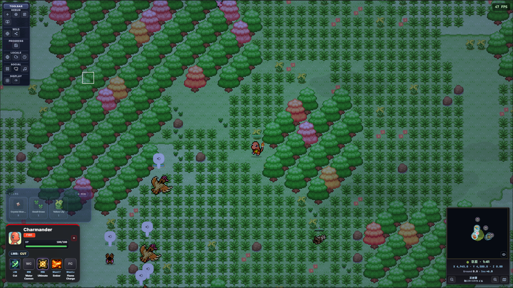
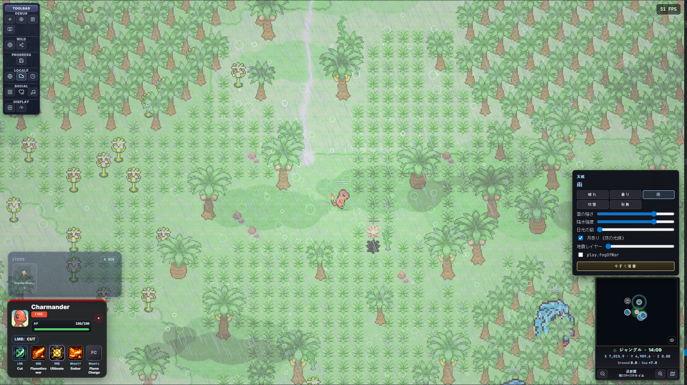

# Experimento: gerador procedural de região

Projeto em **HTML, CSS e JavaScript (ES Modules)** focado em geração procedural de mapa, exploração em tempo real e simulação de ecossistema no estilo Pokémon 2D.



## O que existe hoje

- **Menu principal e fluxos separados** para jogar, depurar e abrir laboratórios.
- **Modo jogo** com exploração em tempo real, minimapa interativo, combate, HUD contextual e câmera.
- **Mundo procedural** com biomas, elevação, umidade, clima e ciclo de dia/noite.
- **Sistema de Pokémon selvagens** com spawn dinâmico, grupos, comportamento social e cenários.
- **Áudio em camadas** (BGM, ambience, SFX, cries), incluindo sistema de Far Cry e controles no minimapa.
- **Ferramentas de debug e tuning** para inspeção de tiles, import/export de JSON, overlays e ajustes de performance.

## Visual showcase

### Main flow





### Dynamic environment and weather

`dynamic-enviroment.png` mostra a proposta central de atmosfera do projeto: clima e iluminação mudando em runtime para alterar leitura de terreno, navegação e sensação de exploração, sem trocar de mapa.








## Entradas da aplicação

- `index.html` — landing com atalhos para os modos e labs.
- `play.html` — experiência principal de jogo.
- `splash-and-game-menu.html` — fluxo com splash/menu cinematográfico.
- `debug-play.html` — modo de ferramentas e debug.
- `biomes.html` — explorador visual de biomas.
- `social-simulation.html` — sandbox de simulação social.
- `neural-behavior-lab/index.html` — laboratório de IA comportamental.
- `terrain-relief-lab.html` e `terrain-13-blocks.html` — labs de relevo/autotile.
- `pokemon-anim-lab.html` — laboratório de animações PMD.

## Como executar

Como o projeto usa módulos ES, rode com servidor local:

```bash
npx --yes serve .
```

Abra a URL mostrada no terminal (ex.: `http://localhost:3000`) e acesse `index.html`.

Alternativa: usar **Live Server** no VS Code/Cursor na raiz do projeto.

## Organização de código (visão geral)

- `js/main.js` — orquestração principal do fluxo de jogo.
- `js/generator.js` — geração procedural de mundo e dados-base de terreno.
- `js/render.js` + `js/render/` — pipeline de render, minimapa, HUD e overlays.
- `js/wild-pokemon/` — sistemas de spawn, IA, grupos e comportamento selvagem.
- `js/moves/` — gerenciamento de golpes, projéteis e colisões.
- `js/audio/` — mix, ambience, trilhas e efeitos sonoros.
- `js/main/` — subsistemas de runtime (tempo, clima, câmera, UI contextual, persistência etc.).

## Documentação principal

- [Atalhos de teclado e mouse](docs/KEYBOARD-SHORTCUTS.md)
- [Constantes principais do jogo](docs/CONSTANTES-PRINCIPAIS-DO-JOGO.md)
- [Far Cry (áudio, minimapa e unknown queue)](docs/FAR-CRY-FEATURE.md)
- [Sistema social no numpad](docs/SOCIAL-NUMPAD.md)
- [Combate (mouse, voo, trajetória e colisão)](docs/COMBAT-FLIGHT-MOUSE-AND-TRAJECTORY.md)
- [Pipeline National Dex](docs/NATIONAL-DEX-PIPELINE.md)
- [Arquitetura de render](docs/rendering_architecture.md)
- [Notas de performance](docs/performance.md)
- [Plano e abordagem](docs/PLANO-E-ABORDAGEM.md)

## Status

O projeto evoluiu de um protótipo de geração para um **sandbox jogável com múltiplos subsistemas** (exploração, combate, social, áudio e labs). O README agora reflete essa fase atual.
